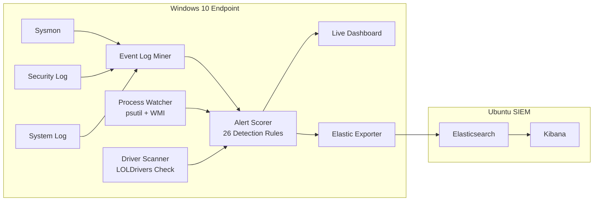

# WinSpector


A Windows process and driver activity monitor I built for detection engineering research. It collects telemetry from Sysmon and Windows event logs, scores activity against 26 detection rules mapped to MITRE ATT&CK, displays alerts in a live terminal dashboard, and exports to Elasticsearch for SIEM analysis.


> **Scope:** This is a detection engineering research project, not a production EDR. See [Limitations](#limitations) for an honest assessment of the gaps and how they can be addressed.


---


## Table of Contents


- [Architecture](#architecture)

- [Modules](#modules)

- [Detection Rules](#detection-rules)

- [Sigma Rules](#sigma-rules)

- [Installation](#installation)

- [Running](#running)

- [Configuration](#configuration)

- [Real Detections](#real-detections)

- [Dependencies](#dependencies)

- [Limitations](#limitations)


---


## Architecture





**Lab network:** All VMs run on an isolated host-only network segment. No traffic leaves the lab.


| VM | Role |

|---|---|

| Win10 | Target endpoint + WinSpector monitor |

| Ubuntu 22.04 | Elasticsearch 9.4.2 + Kibana 9.4.2 |

| Kali Linux | Attacker simulation |

| Flare VM | Malware static analysis (network-isolated) |


---


## Modules


| # | Module | Description |

|---|---|---|

| 1 | `process_watcher.py` | psutil + WMI process snapshot diff every 5 seconds. SHA-256 hashing and Authenticode signature verification via batched PowerShell. Signature cache with 10-minute TTL. |

| 2 | `driver_scanner.py` | Enumerates loaded kernel drivers via Win32_SystemDriver. Hashes each `.sys` binary and checks against a local LOLDrivers database (623 entries, 2028 SHA-256 hashes). Integrity-verified on startup via SHA-256 manifest. |

| 3 | `event_log_miner.py` | Incremental EvtQuery/EvtNext reader for Sysmon/Operational (EID 1,3,7,8,10,11), Security (EID 4688), and System (EID 7045). Cursor persisted in SQLite WAL-mode database. |

| 4 | `alert_scorer.py` | 26 additive detection rules. Scoring is deterministic — same input always produces the same output. Rules are pure functions with no side effects. Score capped at 100. |

| 5 | `dashboard.py` | Five-panel Rich terminal TUI: header, alerts, processes, event stream, driver scanner, status bar. |

| 5 | `elastic_exporter.py` | Elasticsearch Bulk API export with SQLite-backed persistent queue. Alerts survive process crashes and are retried on reconnect. Supports HTTPS and API key authentication. |

| — | `config.py` | Centralised configuration. All environment-specific values read from environment variables with safe defaults. No hardcoded addresses or credentials. |

| — | `winspector_service.py` | Windows service wrapper using pywin32 ServiceFramework. Starts on boot, restarts after crash (3 attempts, 60-second delay). |


---


## Detection Rules


| Rule | Technique | Score | MITRE ATT&CK |

|---|---|---|---|

| RULE-001 | svchost.exe parent is not services.exe | +70 | T1036 |

| RULE-002 | svchost.exe running without -k flag | +60 | T1036 |

| RULE-003 | powershell.exe spawned by cmd.exe | +35 | T1059 |

| RULE-004 | Unsigned binary in %TEMP% or %APPDATA% | +55 | T1036 |

| RULE-005 | Unsigned binary (any location) | +30 | T1036 |

| RULE-006 | Shell spawned by non-standard parent | +40 | T1059 |

| RULE-007 | cmd.exe spawned by %TEMP% binary | +60 | T1059 |

| RULE-008 | PE binary with blank metadata fields | +35 | T1036 |

| RULE-009 | Executable dropped to %TEMP% by shell | +55 | T1105 |

| RULE-010 | Outbound TCP from %TEMP% binary | +70 | T1071 |

| RULE-011 | Outbound connection to non-standard port | +25 | T1071 |

| RULE-012 | Driver SHA-256 matches LOLDrivers database | +100 | T1014 |

| RULE-013 | Unsigned kernel driver | +60 | T1014 |

| RULE-014 | Driver loading from non-standard path | +50 | T1014 |

| RULE-015 | Recon tool spawned by suspicious-path binary | +50 | T1082 |

| RULE-016 | LOLBin abuse (certutil -urlcache, mshta, wscript) | +60 | T1218 |

| RULE-017 | PowerShell encoded command (-EncodedCommand) | +65 | T1027 |

| RULE-018 | PowerShell download cradle (IEX / DownloadString) | +70 | T1059.001 |

| RULE-019 | LSASS process access (Sysmon EID 10) | +80 | T1003.001 |

| RULE-020 | CreateRemoteThread injection (Sysmon EID 8) | +75 | T1055 |

| RULE-021 | DLL loaded from suspicious path (Sysmon EID 7) | +55 | T1574 |

| RULE-023 | WMI spawning child process | +65 | T1047 |

| RULE-024 | Base64 / encoded content in command line | +45 | T1027 |

| RULE-025 | Scheduled task creation (schtasks /create) | +60 | T1053.005 |

| RULE-026 | Registry run key modification (reg add) | +55 | T1547.001 |

| RULE-SVCINSTALL | New service installed (EID 7045) | +30 | T1543.003 |


**Alert levels:** INFO (0-29) · LOW (30-49) · MEDIUM (50-74) · HIGH (75+)


Scores are additive and capped at 100. A LOLDrivers hash match (RULE-012) returns 100 immediately.


---


## Sigma Rules


Two detection rules derived from real observations, validated with sigma-cli 3.0.2 and converted to Elasticsearch Lucene queries.


**`sigma_rules/temp_exe_outbound_connection.yml`** — severity: HIGH

Detects an executable running from %TEMP% or %APPDATA% making an outbound TCP connection to a non-standard port. MITRE: T1105, T1071.001.


**`sigma_rules/recon_tool_from_suspicious_path.yml`** — severity: MEDIUM

Detects reconnaissance tools (whoami, ipconfig, net, etc.) spawned by a parent process running from %TEMP% or %APPDATA%. MITRE: T1057, T1082, T1036.


Lucene queries for Kibana Discover:


```

# Temp executable outbound connection

(process.executable:(*\\AppData\\Local\\Temp\\* OR *\\AppData\\Roaming\\*))

AND network.direction:true

AND (NOT (destination.port:(80 OR 443 OR 8080 OR 8443)))


# Recon tool from suspicious path

(process.executable:(*\\whoami.exe OR *\\ipconfig.exe OR *\\hostname.exe

  OR *\\net.exe OR *\\net1.exe OR *\\netstat.exe OR *\\tasklist.exe

  OR *\\systeminfo.exe OR *\\nltest.exe OR *\\nslookup.exe))

AND (process.parent.executable:(*\\AppData\\Local\\Temp\\* OR *\\AppData\\Roaming\\*))

```


---


## Installation


### Prerequisites


- Windows 10/11 x64

- Python 3.12

- [Sysmon v15+](https://learn.microsoft.com/sysinternals/downloads/sysmon)

- PowerShell command-line auditing enabled (produces Security EID 4688)

- Administrator privileges


### Steps


```powershell

git clone https://github.com/Shantanu0001/winspector.git

cd winspector


python -m venv .venv

.venv\Scripts\Activate.ps1

pip install -r requirements-pinned.txt

```


Install Sysmon with the provided configuration:


```powershell

sysmon64.exe -accepteula -i sysmon_config.xml

```


`sysmon_config.xml` enables process creation, network connections, remote thread creation, process access, and file creation events. Image load events (EID 7) are filtered to suspicious paths only to keep volume manageable.


---


## Running


### As a Windows service


The service starts on boot, runs without a logged-in user, and restarts after crashes.


```powershell

# Install and start — run as Administrator

powershell -ExecutionPolicy Bypass -File install_service.ps1


# Check status

sc query WinSpector

Get-Content logs\winspector.log | Select-Object -Last 10


# Stop and remove

powershell -ExecutionPolicy Bypass -File uninstall_service.ps1

```


### As a foreground console app


Provides the live terminal dashboard. Run as Administrator.


```powershell

# Clear event logs before each session

wevtutil cl Security

wevtutil cl "Microsoft-Windows-Sysmon/Operational"

wevtutil cl System

Remove-Item data\winspector.db -ErrorAction SilentlyContinue


python -W error main.py

```


If noisy background agents are running (Splunk forwarder, Puppet, Nessus), stop them first to prevent event log backlog from slowing the poll loop:


```powershell

Stop-Service SplunkForwarder, puppet, nessus -Force -ErrorAction SilentlyContinue

```


---


## Configuration


All values are read from environment variables. No hardcoded addresses or credentials exist in the source code.


| Variable | Default | Description |

|---|---|---|

| `WINSPECTOR_ELASTIC_URL` | `http://localhost:9200` | Elasticsearch endpoint |

| `WINSPECTOR_ELASTIC_API_KEY` | _(empty)_ | Base64-encoded API key for authenticated exports |

| `WINSPECTOR_ELASTIC_VERIFY_SSL` | `true` | Set `false` to skip certificate verification |

| `WINSPECTOR_COMPUTER_NAME` | `platform.node()` | Hostname tag on exported alerts |


Example:


```powershell

$env:WINSPECTOR_ELASTIC_URL     = "https://your-elastic-host:9200"

$env:WINSPECTOR_ELASTIC_API_KEY = "your-base64-api-key"

python -W error main.py

```


> By default WinSpector exports over plain HTTP with no authentication, which is safe only on an isolated network. For any shared or internet-reachable deployment, use an `https://` endpoint with an API key.


---


## Real Detections


All detections were observed on a live Windows 10 endpoint during controlled tests.


| Sample | Technique | Rules fired | Score |

|---|---|---|---|

| `totally_normal.exe` | Meterpreter reverse_tcp | RULE-004, RULE-005 | 55 |

| `svchost32.exe` | Masquerading + whoami recon | RULE-004, RULE-015 | 90 |

| `certutil.exe` | LOLBin download (-urlcache) | RULE-016 | 60 |

| `eicar_test.exe` | Executable dropped to %TEMP% | RULE-009 | 55 |

| `powershell.exe` | Encoded command (-EncodedCommand) | RULE-017 | 65 |

| `powershell.exe` | Download cradle (Invoke-Expression) | RULE-018 | 70 |

| `lsass.exe` (target) | LSASS memory access | RULE-019 | 80 |

| `notepad.exe` (target) | CreateRemoteThread injection | RULE-020 | 75 |

| `version.dll` | DLL loaded from %TEMP% | RULE-021 | 55 |

| `calc.exe` | WMI process spawn | RULE-023 | 65 |

| `schtasks.exe` | Scheduled task creation | RULE-025 | 60 |

| `reg.exe` | Registry run key modification | RULE-026 | 55 |


**Static analysis:**

A msfvenom x64 reverse_tcp stager was analysed with Detect-It-Easy and PE-bear. Key findings: non-standard `.zvrd` section with RWX permissions, entry point in the last section, single import (`VirtualProtect`), all other API calls resolved at runtime via PEB walking. SHA-256: `467db73b0a1ca21eff04f03b35d345cbc373711cb081173a67df943871c88a48`.


---


## Dependencies


**Runtime** — pinned with SHA-256 hashes in `requirements-pinned.txt`:


| Package | Version | Purpose |

|---|---|---|

| psutil | 7.2.2 | Process enumeration |

| pywin32 | 312 | Windows API (EvtQuery, WMI, Authenticode) |

| rich | 15.0.0 | Terminal dashboard |


**Development only:**


| Package | Version | Purpose |

|---|---|---|

| sigma-cli | 3.0.2 | Sigma rule validation |

| pySigma | 1.3.3 | Sigma rule processing |

| pySigma-backend-elasticsearch | 2.0.3 | Lucene query conversion |


Install with `--require-hashes` to enforce supply-chain integrity:


```powershell

pip install -r requirements-pinned.txt --require-hashes

```


---


## Limitations


The following are known gaps versus a production EDR, along with the path to address each one.


### User-mode process — terminable by an attacker


**Gap:** WinSpector runs as a user-mode elevated process. An attacker with administrator rights can terminate it with `taskkill /f /im python.exe`.


**Solution:** The full solution requires a Windows kernel minifilter driver registered with protected-process status (`PS_PROTECTED_ANTIMALWARE_LIGHT`). This needs an EV (Extended Validation) code signing certificate (~$500/year from DigiCert or Sectigo) and a WHQL submission to Microsoft (2–4 weeks, free). Microsoft co-signs the binary, and only then does Windows grant the protection level at load time.


An interim partial hardening — available now without WHQL — is to modify the service's DACL to deny `PROCESS_TERMINATE` to the Administrators group, allowing only SYSTEM to stop it. This is implemented in `winspector_service.py` via `win32security`. It stops casual `taskkill` but does not stop a SYSTEM-level attacker.


---


### No tamper-resistant service


**Gap:** The Windows service can be stopped with `sc stop WinSpector` by any administrator.


**Solution:** `SERVICE_PROTECTED_ANTIMALWARE_LIGHT` requires the same WHQL co-signature described above. Without it, the service can be stopped by any admin. The failure recovery configuration (`sc failure WinSpector ... actions= restart/60000`) provides auto-restart after accidental or non-malicious stops, which is the best available mitigation without WHQL.


---


### Sysmon dependency


**Gap:** WinSpector reads from the Sysmon event log. A privileged attacker can unload the Sysmon driver (`fltMC unload SysmonDrv`) or clear event logs faster than the 5-second poll interval, creating a blind spot.


**Solution:** Replace event log polling with direct ETW (Event Tracing for Windows) consumption. The kernel providers `Microsoft-Windows-Kernel-Process` (GUID `{22FB2CD6-0E7B-422B-A0C7-2FAD1FD0E716}`) and `Microsoft-Windows-Kernel-Network` deliver process and network events in real time via callback, bypassing the event log entirely. This can be implemented in Python using `ctypes` to call `StartTrace`, `EnableTraceEx2`, `OpenTrace`, and `ProcessTrace` — no kernel driver required for the consumer side. Events arrive within milliseconds rather than at 5-second intervals, and log clearing has no effect on the ETW stream.


---


### Alert deduplication


**Gap:** High-frequency events — such as repeated LSASS access by Task Manager — generate one alert per event, flooding the panel (66 alerts were observed in a single session during RULE-019 testing).


**Solution:** Add a deduplication layer in `alert_scorer.py` or `dashboard.py` that groups alerts by rule + entity within a rolling time window (e.g. 60 seconds). The first occurrence fires immediately; subsequent identical alerts within the window increment a counter rather than creating new entries. This is a straightforward in-memory change requiring no new dependencies.


---


### Rule coverage


**Gap:** 26 rules cover a subset of MITRE ATT&CK. Real-world attackers use hundreds of techniques not currently detected.


**Solution:** The scoring framework is designed for extension — adding a rule is adding a conditional block in `score_event()`. Priority additions would cover: DLL hijacking (T1574.001), token impersonation (T1134), named pipe creation (T1559), UAC bypass patterns (T1548.002), and AMSI bypass via memory patching. Each new rule should follow the pattern: derive from a real observation, write the condition, validate with a live test, document the MITRE technique.


---


### RULE-021 requires Sysmon EID 7 configuration


**Gap:** DLL image load detection (RULE-021) does not work on a default Sysmon install because EID 7 logging is disabled by default due to its high event volume.


**Solution:** Apply `sysmon_config.xml` from this repository, which filters EID 7 to suspicious paths only (`%TEMP%`, `%APPDATA%`, `Users\Public`). This keeps volume low while capturing the high-signal cases. The filter can be tuned further by adding unsigned-only filtering: `<Signed condition="is">false</Signed>` inside the ImageLoad rule group.


---


### Single endpoint


**Gap:** One WinSpector instance monitors one host. There is no aggregation across multiple endpoints.


**Solution:** The Elasticsearch export is already the aggregation layer. Deploying WinSpector as a service on multiple endpoints — each pointing `WINSPECTOR_ELASTIC_URL` at the same Elasticsearch cluster — produces a multi-host alert feed in Kibana automatically. The `computer` field in every exported alert identifies the source host. No code changes are required; only deployment and `WINSPECTOR_COMPUTER_NAME` configuration per host.


---


## Author


helix-d3t0x · [github.com/Shantanu0001/winspector](https://github.com/Shantanu0001/winspector)